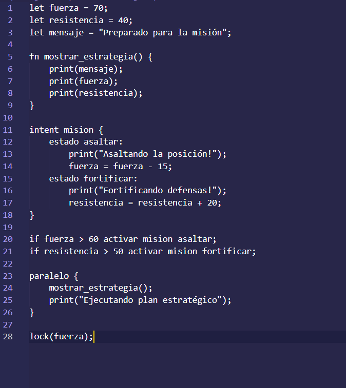
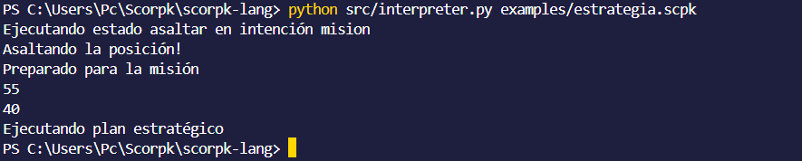

# Scorpk - Un Lenguaje de Programación Minimalista

Scorpk es un lenguaje de programación en desarrollo, diseñado para ser simple, concurrente y expresivo. Este prototipo (versión 0.3) soporta variables, funciones, intenciones, condicionales, y concurrencia, con aplicaciones en simulaciones tácticas y sistemas IoT.

## Características
- **Variables**: Declara y bloquea variables (`let`, `lock`).
- **Funciones**: Define funciones reutilizables (`fn`).
- **Intenciones**: Gestiona flujos basados en estados (`intent`, `activar`).
- **Condicionales**: Toma decisiones dinámicas (`if variable > número acción`).
- **Concurrencia**: Ejecuta tareas en paralelo (`paralelo`).
- **Expresiones**: Suma, resta, multiplicación (`variable + número`, etc.).
- **Resaltado de sintaxis**: Soporte básico en VS Code para archivos `.scpk`.

## Instalación
1. Clona el repositorio:
   ```bash
   git clone https://github.com/ScorpkID/scorpk-lang.git
   cd scorpk-lang
   ```
2. Asegúrate de tener Python 3.8+ instalado.
3. Configura la codificación UTF-8 en tu terminal:
   - En Windows (PowerShell):
     ```powershell
     chcp 65001
     ```

## Uso
Ejecuta un programa Scorpk:
```powershell
python src/interpreter.py examples/estrategia.scpk
```

### Ejemplo: Simulación Estratégica
Archivo: `examples/estrategia.scpk`
```scorpk
let fuerza = 70;
let resistencia = 40;
let mensaje = "Preparado para la misión";

fn mostrar_estrategia() {
    print(mensaje);
    print(fuerza);
    print(resistencia);
}

intent mision {
    estado asaltar:
        print("Asaltando la posición!");
        fuerza = fuerza - 15;
    estado fortificar:
        print("Fortificando defensas!");
        resistencia = resistencia + 20;
}

if fuerza > 60 activar mision asaltar;
if resistencia > 50 activar mision fortificar;

paralelo {
    mostrar_estrategia();
    print("Ejecutando plan estratégico");
}

lock(fuerza);
```

Salida:
```
Ejecutando estado asaltar en intención mision
Asaltando la posición!
Preparado para la misión
55
40
Ejecutando plan estratégico
```

## Capturas de Pantalla
- **Resaltado de sintaxis en VS Code**:
  
  *(Placeholder: Toma una captura de `estrategia.scpk` abierto en VS Code mostrando el resaltado.)*
- **Salida de ejemplo**:
  
  *(Placeholder: Toma una captura de la salida de `estrategia.scpk` en PowerShell.)*

## Estructura del Proyecto
- `src/interpreter.py`: Intérprete de Scorpk.
- `docs/syntax.md`: Documentación de la sintaxis.
- `examples/`: Programas de ejemplo (`estrategia.scpk`, `batalla.scpk`, etc.).
- `.vscode/`: Configuración para resaltado de sintaxis en VS Code.

## Contribuir
¡Únete al desarrollo! Clona el repositorio, prueba los ejemplos, y reporta problemas o sugerencias en [Issues](https://github.com/ScorpkID/scorpk-lang/issues).

### Lanzamiento Alfa
Scorpk v0.3 está en fase alfa. ¡Prueba el lenguaje y comparte tus ideas! Mira nuestro anuncio en X: *(Inserta el enlace al post en X después de publicarlo)*.

## Próximos Pasos
- Soporte para más condicionales (`<`, `==`, bloques `if`).
- Tipado híbrido (`let x: int`, evolución dinámica).
- Extensión completa para VS Code.
- Más ejemplos complejos.

---

Scorpk es un proyecto experimental. ¡Explora, prueba y diviértete programando!